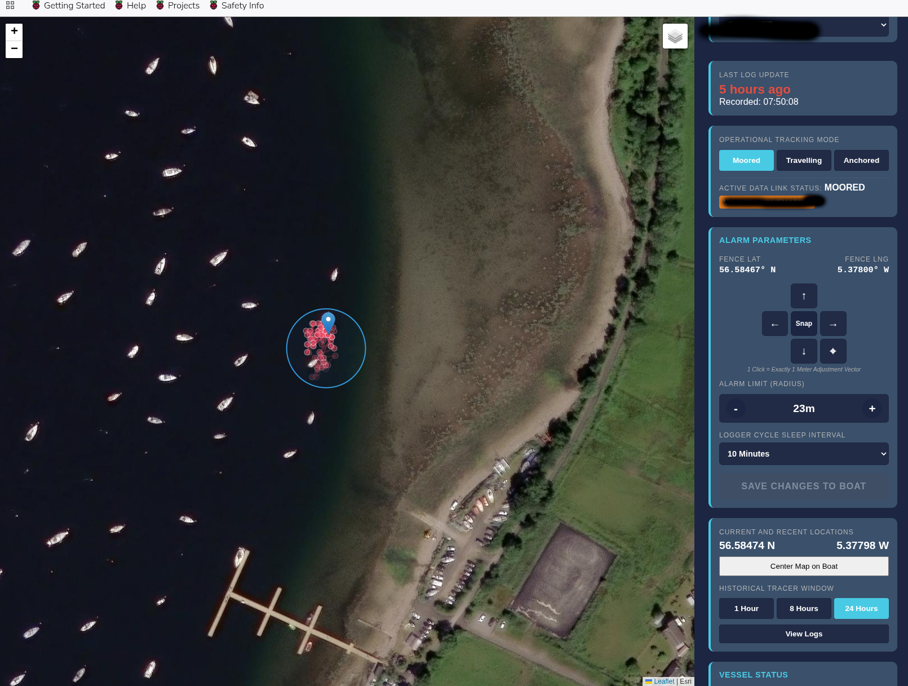
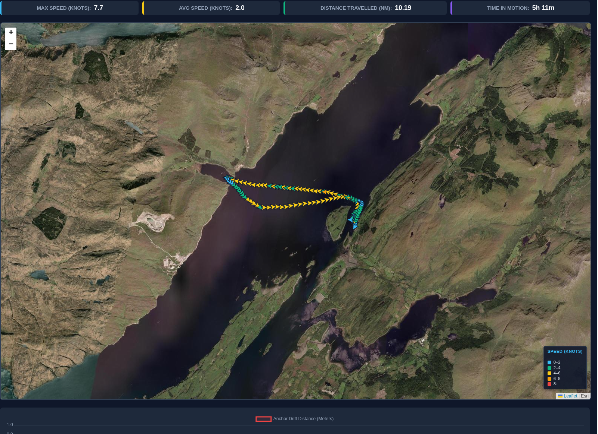
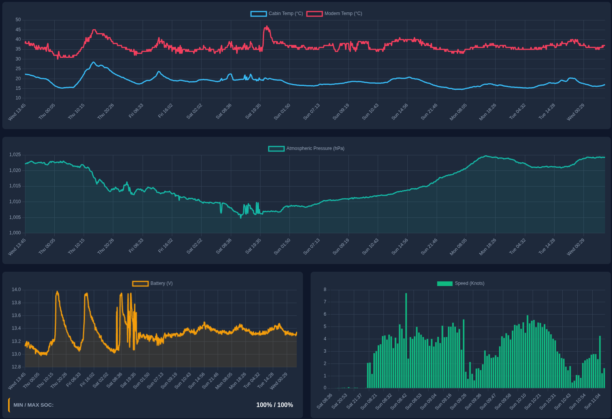

# BoatLogger
Using a lilygo 7670 to monitor boat position on a mooring, at anchor or when travelling on a website. Also acts as an anchor alarm via website, locally with a buzzer or via SMS alert messages.

# Local Access
If you don't have internet access but need to change key settings, you can get to the key parameters of the system by moving the toggle switch, this wakes the device, then wiggle the toggle switch while the LED is flashing. This sets up a wires access-point and a small website for adjusting settings and for viewing error logs. Join the AP from your smart-phone then open the webpage (192.168.1.4 ?).

# Web Access
**index.php** runs a "now" view of the boat, with a satellite view of the position and geofence. It also shows key values from the boat like battery state, temperature, humidity and barometric pressure. It also monitors how many logs have been missed during a run. Also indicates how the data have been sent, i.e. via your marina wifi or cellular data.

**viewlogs.php** runs a historical view of the stored data, how does battery state vary from day to day, where have you been, what was the maximum speed etc. Is your mooring moving over time? It also tries to parse contiguos traveling sections in the database so you can look at miles travelled, speed and time for each seperate journey.

The system includes the code for a website (mine is running on apache with a raspberryPi) and the code main.py to run on the lilygo on your boat.

## Why?

My primary aim was obvious: 

Well my boat lives on a mooring three hours drive away and it's the first time I've kept a boat on a mooring, I was keen to monitor the condition of the vessel so I can reassure myself that it hasn't floated away, or that the batteries are going flat. With the boat logger I can see that the boat is still where it's meant to be. I can see the temperature and humidity aboard. I can see the battery voltage vary throughout the day as the solar panels charge the battery. It's very reassuring.

A secondary aim was less obvious:

I'm a geek by nature and like building things in hardware or code. I'm also a university lecturer who teaches on a masters course in Applied Artificial Intelligence and User Experience (AAIUX, Abertay). Or rather I help run a course on which the students are taught AI, I mainly teach cognitive psychology. Anyway, I've vibe-coded a few software tools and online experiments and have acheived fairly good results with co-pilot and Gemini. Usually though, I'm the expert in the room and I know exactly the pitfalls of a particular methodology and I'm able to supervise the AI quite closely. I wanted to know how far I could get without that kind of background knowledge. I know very little about ESP32 boards, I've never programmed one before. I only know a little about building and hosting websites, barely anything about maria databases, .php or javascript. So here was a challenge for me. Build a system that I certainly could not easily build for myself. Did it work? Yes, eventually. Lots of errors and wrong directions along the way. At some points Gemini suggested I abandon microPython and go for Arduino instead because it didn't have the power to acheive the goals. Then when Arduino also failed 'we' realised the flaw wasn't in the Thonny/MicroPython it was in our choices. Often Gemini would concentrate on solving one current problem, while breaking the system for other reasons - hyperfocus. Sometimes important choices were forgotten while solving one problem and then we would realise that other problems were created by the new choices. For example realing that the boards we had didn't posses back up batteries for the GPS almanac and ephemeris data. So every time the board went to sleep these data were lots and a new GPS had to be started from scratch taking many minutes. This lead us to using CPU throttling to save power instead of wake/sleep cycles. Much later Gemini announced that we could use AGPS to speed GPS acquisition - using a cellular connection to retrieve almanac and ephemeris data. In the end we implemented this option but I don't use it. Because if you boat is in the boondocks and you lose cellular and wifi connectivity you don't want to shut down and lose GPS connectivity. Anyway, that's just one of the deadends explored during the creation of the system.

## Why not use an existing system?

1) I wasn't aware of any, though I am now. But building a boat computer system that also does anchor alarm wasn't really my aim. Also, that wouldn't fit with my goal of vibe-coding and vibe-hardwareing(?) my system.

2) My boat is fairly light on tech. It doesn't have a computer, I use a rugged tablet that I bring home so I can plan future journeys and summarise my logs.

3) It's likely that someone could add functionality to communicate with existing hardware onboard.

## Future updates

One potential update is to access the VictronConnect bluetooth portal to also retrieve battery and solar charging status. Though I can currently infer this kind of stuff from a simple voltage divider that I have already.

## ⚙️ Configuration & Setup

Before flashing the ESP32 or launching the web server, you must configure the system to use your own secure passwords, database, and API keys. Search the codebase for the placeholder strings below and replace them with your live data.

### 🐍 MicroPython Configuration (`main.py`)

| Variable / Line Area | Placeholder String | Description |
| :--- | :--- | :--- |
| `HOME_SSID` | `YOUR_HOME_WIFI_SSID` | The name of the primary Wi-Fi network the board should connect to when docked at home/marina. |
| `HOME_GATEWAY` | `http://YOUR_DOMAIN_OR_IP/boatLogger/log.php` | The full HTTP URL pointing to your web server's logging script. |
| `TUNNEL_HOST` | `YOUR_DOMAIN_OR_IP` | The bare domain or IP address of your server (used by the cellular modem to establish a raw TCP socket). |
| `PARAMS` | `YOUR_API_SECRET_KEY` | A secret password used in the URL string to authenticate your ESP32 to your web server. |
| `load_config()` | `YOUR_MOBILE_NUMBER` | The default SMS contact number for geofence breaches and low battery alerts. |
| `load_config()` | `YOUR_BOAT_ID` | The default device ID used in the database to separate your vessel's logs from others. |
| `load_config()` | `0.00000` | The default Latitude and Longitude fallback coordinates. |

### 🐘 Backend Configuration (`viewlogs.php` & `log.php`)

*Note: You must also update these database credentials in `log.php`, `viewlogslist.php`, or any script that writes to or reads from the MySQL database.*

| Variable / Line Area | Placeholder String | Description |
| :--- | :--- | :--- |
| `$db_user` | `YOUR_DB_USER` | The MySQL/MariaDB username with read/write privileges for the logger database. |
| `$db_pass` | `YOUR_DB_PASSWORD` | The password for your database user. |
| `$db_name` | `YOUR_DB_NAME` | The name of the database table (default is usually `boat_tracker`). |
| `$active_vessels` | `YOUR_BOAT_ID` | The fallback device ID string used if the database is currently empty. |
| `leafletMap.setView()` | `[0.00000, 0.00000]` | The default centering coordinates for the Leaflet UI map before data loads. |
